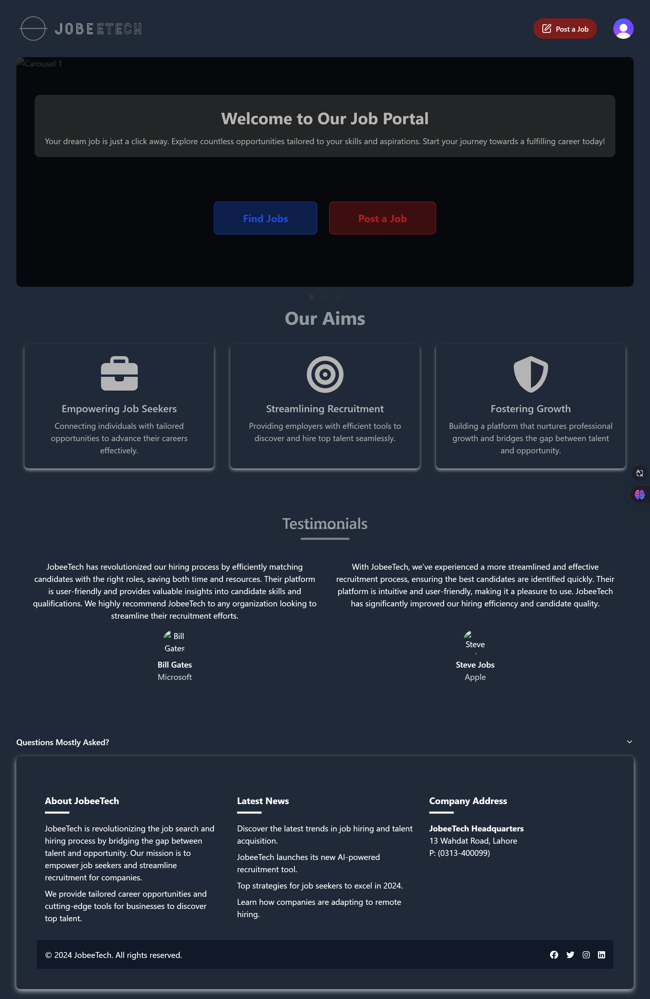

Live here ---> https://jobeetech.netlify.app/

#Connecting supabase wth Clerk
Creating a JWT template in clerk
get a jwt key from supabase
put in clerk jwt template secret

#supabase accesing user ids from clerk
write aquery in sql editor (query availabe in docs)
function requesting_user_ids()

when creating table wherever the user id is referenced, use the call requesting_user_id() function

#Row Level Secruity in Supabase Tables:
1). Jobs :Enable read access for auth users target roles : authenticated
2). Companies : Enable read access for auth users target roles : authenticated
3). Saved Jobs : (we only want to show the jobs which are wishlisted by the currrent user only)
Enable read access for current users target roles : authenticated, RULE : using (requesting_user_id()=user_id )

#Creating Storage Bucket in SUpabase for resumes and logos of companies

#Policy for Saved_jobs:
Enable insert for authenticated users only
Enable delete for users based on user_id (requesting_user_id() = user_id)

#JobListing Search Filter
made changes so it only let you search by the cities of which jobs are posted,

#Policy for applications:
Enable read access for all users
Enable insert for authenticated users only

#Policy for jobs:
Enable update by recuriter_id
target roles: authenticated
(requesting_user_id()=recruiter_id)
